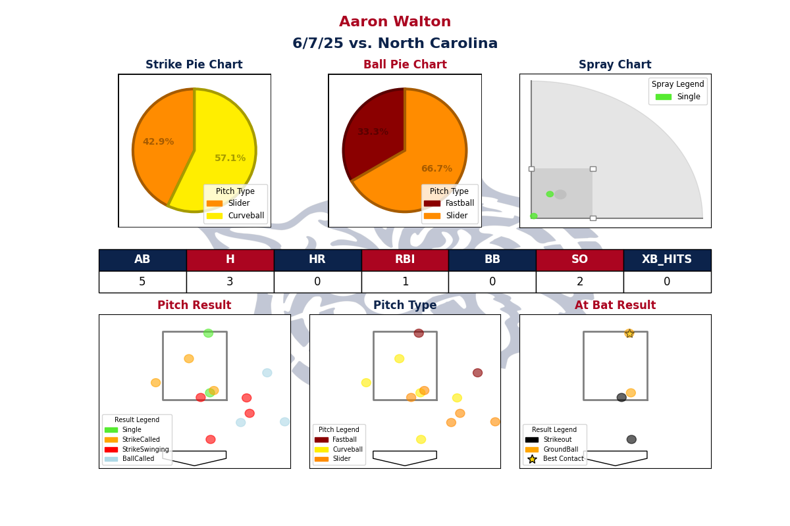

# Aaron Walton Hitting Report

This project generates a **comprehensive hitting report** for UABaseball player **Aaron Walton**, using pitch-by-pitch data from a CSV file. The script analyzes his performance in a single game, producing visualizations such as:

- **Game performance table** (AB, H, HR, RBI, BB, SO, XB_HITS)
- **Strike & ball pitch type pie charts**
- **Spray chart of batted balls**
- **Pitch location visualizations** by result, pitch type, and at-bat outcome
- **Background watermark with Wildcat logo**

The final output is saved as a PNG report image.

---

## 📊 Example Output

Below is an example output of the report generated on **June 7, 2025 vs. North Carolina**:



---

## 🚀 How to Run

### 1. Clone the repository
```bash
git clone https://github.com/ColinGale/UArizonaBaseballHittingReport
cd UArizonaBaseballHittingReport
```

### 2. Install dependencies
This project uses **Python 3.x** with the following libraries:
pip install pandas numpy matplotlib scipy

### 3. Add resources
Make sure the following resources are available:
- res/UABaseballHitterData.csv → Game dataset
- res/wildcat.png → Background logo for report

### 4. Run the script
python src/main.py

This will generate and display the report, saving it as:
AaronWaltonHittingReport_6_7_2025.png

---

## 📂 Project Structure

<pre>
project-root/
│── src/
│   └── main.py # Main script
│── res/
│   ├── UABaseballHitterData.csv
│   │── AaronWaltonHittingReport_6_7_2025.png # Generated report (output)
│   └── wildcat.png
│── README.md # This file
│── .gitignore

</pre>
---

## 🛠️ Functions Overview

- draw_baseball_field(ax) → draws simplified baseball field
- setup_plate_and_strike_zone(ax) → strike zone + home plate view
- setup_game_performance_table(df) → computes AB, H, HR, RBI, etc.
- darken(color, factor) → helper to darken colors for pie charts
- landing_point(df) → calculates landing coordinates of batted balls
- main() → orchestrates the full visualization & report

---

## 📝 Notes

- This project is tailored for **Aaron Walton** (filters `Batter == "Walton, Aaron"`).
- To analyze another player, adjust the filtering logic in main().
- Strike zone dimensions and infield sizes are approximate and can be tuned.

---

## 📌 License

This project is for the University of Arizona Baseball Team and for educational purposes
only.
